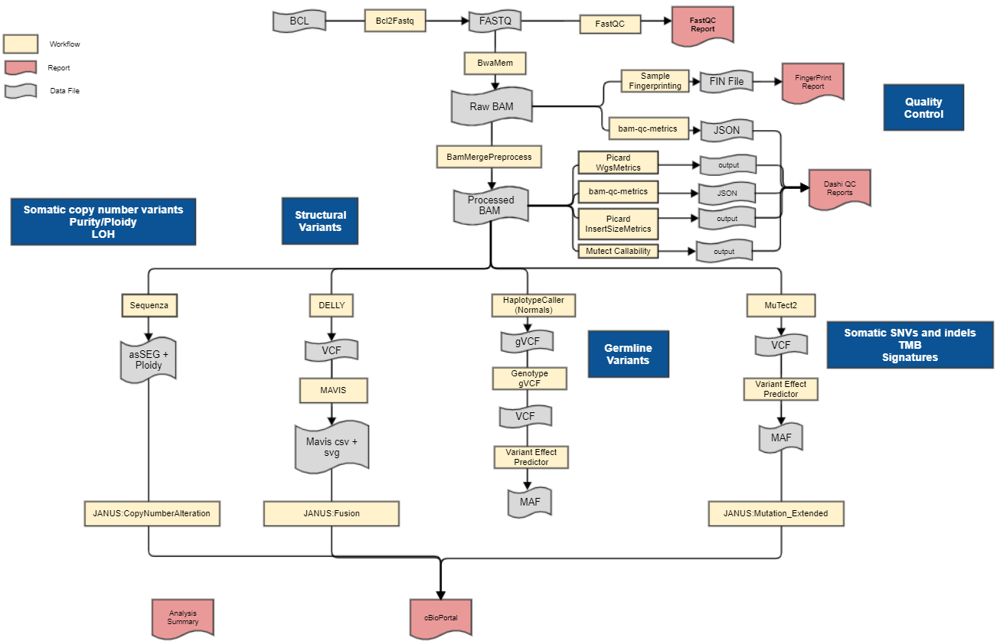

# dockstore_wgsPipeline

The wgsPipeline WDL wraps the WGS Analysis Pipeline. Currently, the wrapper only contains the top 9 workflows in the pipeline, going from Bcl2Fastq to Mutect Callability. 
The workflow is made to run in Docker and uploaded to [Dockstore](https://docs.dockstore.org/en/develop/getting-started/getting-started.html).
You can find OICR's Dockstore page [here](https://dockstore.org/organizations/OICR).
The Docker container is based on [Modulator](https://gitlab.oicr.on.ca/ResearchIT/modulator), which builds environment modules to set up the docker runtime environment.

<p align="center">
  
</p>

### Progress

Workflow Name|Uploaded to Dockstore?|Tested With Preprocess?|Modules Built in Container?|Integrated Into Pipeline?
---|---|---|---|---
bcl2fastq|Y|Y|Y|Y
fastQC|Y|Y|Y|Y
bwaMem|Y|Y|Y|Y
bamQC|Y|Y|Y|Y
bamMergePreprocess|Y|Y|Y|Y
wgsMetrics|Y|Y|Y|Y
insertSizeMetrics|Y|Y|Y|Y
callability|Y|Y|Y|Y
variantEffectPredictor|Y|Y|Y|N
haplotypeCaller|Y|Y|Y|N
sequenza|Y|Y|Y|N
delly|Y|Y|Y|N
mutect2|Y|Y|Y|N
mavis|N|N|Y|N
genotype gVCF|N|N|N|N
sampleFingerprinting|N|N|N|N
JANUS:MutationExtended|N|N|N|N
JANUS:CopyNumberAlteration|N|N|N|N
JANUS:Fusion|N|N|N|N

### Set Up and Run
Currently, this pipeline WDL must be run with Cromwell. 
It uses Cromwell configuration files to mount a directory to the docker container.
The directory contains data modules built with Modulator, which the WDL tasks need to access.
In addition, you must obtain run files locally and build data modules to a local directory.

#### 1. Build Data Modules
- Create a local `data_modules/` directory to store the data modules
    - make sure you have enough disk space as the total size could be 200-300 GB
- In future iterations of the pipeline, this process will be simplified
- Enter the container:
```
# Mount this repository as /pipeline/; mount the data module destination directory as /data_modules/
docker run -it --rm -v ~/repos/WGSPipeline:/pipeline -v ~/data/data_modules:/data_modules g3chen/wgspipeline@sha256:3c0c292c460c8db19b9744be1ea81529c4d189e4c4f9ca9a63046edcf792087d

# Copy prerequisite code module YAMLs into the Modulator code directory (code/gsi/)
cp /pipeline/recipes/data_modules_recipe_prep.yaml code/gsi/data_modules_recipe_prep.yaml
 
# Build the prerequisite code modules
./build-local-code code/gsi/data_modules_recipe_prep.yaml --output /data_modules --initsh /usr/share/modules/init/sh
 
# Copy data module YAMLs into the Modulator data directory (data/gsi/)
cp /pipeline/recipes/data_modules_recipe.yaml data/gsi/data_modules_recipe.yaml
 
# Build the data modules
./build-local-data data/gsi/data_modules_recipe.yaml --output /data_modules --initsh /usr/share/modules/init/sh
 
# Change resulting file permissions
find /data_modules/ -type d -exec chmod 777 {} \; && \
find /data_modules/ -type f -exec chmod 777 {} \;
 
# /data_modules/ should now contain gsi/modulator/modulefiles/Ubuntu18.04/ and gsi/modulator/modulefiles/data/
```

#### 2. Obtain Files Locally
In the test json, change file paths like so:
- File type files should be copied to local
    - E.g. use scp to copy from UGE
    - In the json, change the file path from UGE to local path
- String type files should be copied or moved to the mounted directory, if it's not already part of a module
    - In the json, change the file path to how the file would be accessed from inside the docker container
- $MODULE_ROOT paths can stay the same
```
# File type files, UGE v.s. Dockstore:
# File is copied to local machine
"wgsPipeline.callability.intervalFile": "/.mounts/labs/gsi/testdata/wgsPipeline/input_data/wgsPipeline_test_pcsi/hg19_random.genome.sizes.bed"
"wgsPipeline.callability.intervalFile": "/home/ubuntu/data/sample_data/callability/hg19_random.genome.sizes.bed"
 
# String type files, UGE v.s. Dockstore:
# /data_modules/ is a directory mounted to the docker container
"wgsPipeline.processedBamQC.bamQCMetrics_refFasta": "/.mounts/labs/gsi/modulator/sw/data/hg19-p13/hg19_random.fa"
"wgsPipeline.processedBamQC.bamQCMetrics_refFasta": "/data_modules/gsi/modulator/sw/data/hg19-p13/hg19_random.fa"
 
# Root type paths, UGE v.s. Dockstore:
# The value of $MODULE_ROOT changes, but the path stays the same
"wgsPipeline.bwaMem.runBwaMem_bwaRef": "$HG19_BWA_INDEX_ROOT/hg19_random.fa"
"wgsPipeline.bwaMem.runBwaMem_bwaRef": "$HG19_BWA_INDEX_ROOT/hg19_random.fa"
```

#### 3. Run with Cromwell
Submit the preprocessed subworkflow and modified json to Cromwell, with configs and options attached
```
# Validate the wrapper workflow and json
java -jar $womtool validate [WDL] --inputs [TEST JSON]
 
# For example:
java -jar $womtool validate wgsPipeline.wdl --inputs tests/wgsPipeline_test_cre_uge.json

# Submit to Cromwell
java -Dconfig.file=[CONFIG] -jar $cromwell run [WRAPPER WDL] --inputs [JSON] --options [OPTIONS]
 
# For example:
java -Dconfig.file=local.config -jar $cromwell run wgsPipeline.wdl --inputs tests/wgsPipeline_test_cre.json --options options.json
```

### Links
People on the GSI team can find additional information about this project on the [project page](https://wiki.oicr.on.ca/display/GSI/Dockstore+Project), [pipeline page](https://wiki.oicr.on.ca/display/GSI/WGS+Analysis+Pipeline+%3A+GSI+Standard+Analysis%2C+Tumour+with+Matched+Normal), and [tutorial page](https://wiki.oicr.on.ca/pages/viewpage.action?pageId=146836087).

### Preprocess

Subworkflows are preprocessed using subworkflow_preprocess in [gsi-wdl-tools](https://github.com/oicr-gsi/gsi-wdl-tools).
The script changes task-level variables to workflow-level variables, and adds a Docker parameter in each runtime.

### Limitations

- The workflow requires Cromwell configs and options to run, due to mounting local data modules to the container --> improve the preprocessor to eliminate all supplemental config requirements.
- Dockstore tests are not automated --> implement Dockstore checker workflows
- Dockstore refresh is not automated --> implement Dockstore GitHub Apps